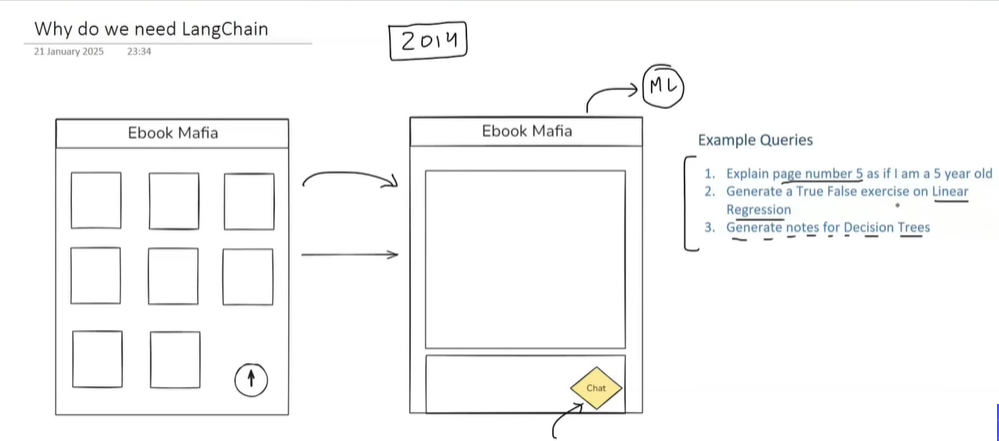
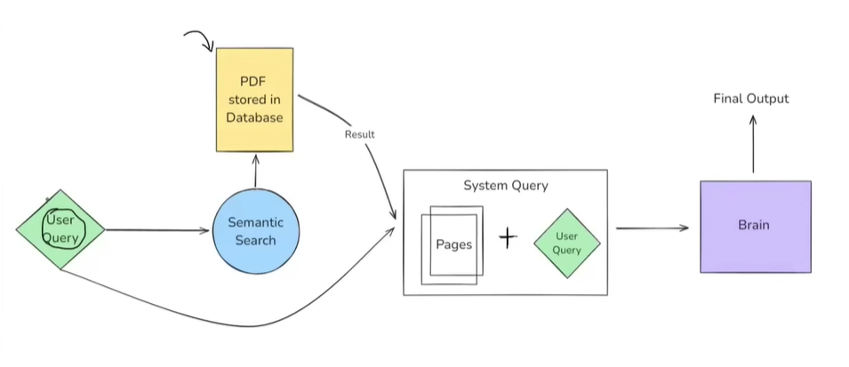
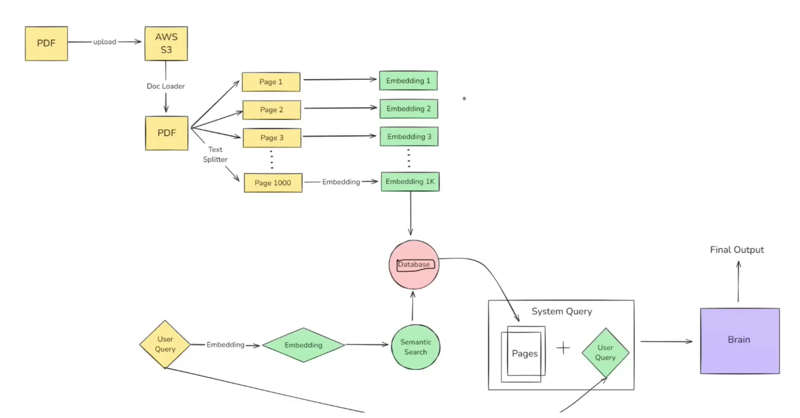

Lecture: 3 

Langchain: opensource framework for developing applications powered by large language models(LLMs).

Brainstorm image for llm apps usecase.

Workflow for application: 

Semantic Search: 
you  convert the text in form of embeddings which is multi-dimensional vectors. Wee also convert the provided user query to embeddings. Once, we have embedding generated for user query and the available knowledge base. We do similrity search with the available knowledgge base vectors. The embedings which is most closer to the user query embeddings are used for final answer generation using Context aware LLMs.

We do Chunking for 1000 pages for a pdf file. We can split based on para, pages, and others. For now we will do based on pages and then create 1000 embeddings from pages.

Our LLM model will have  NLU(natural language understanding) and Context aware text generation capabilities.

Complete Architecture for pdf analysis using LLM

Challenge 1: Devellping Brain of this architecture which must be NLU and Context aware text generation llm models. This challnege has been handled and these LLM has been generated.

Challenge 2: Model training and decentralization of apis for llm answer generation, which has been solved. 

Challenge 3: There are a lot of modular component which are involved in development such as Document Loader, Text Splitter, Embeddings generation models, Vector Databases, LLM model, Retrieval augmented generation. 

If we start to develop application from scratch, it takes a lot of time and complex flow to develop. If in case, we want to change the models which are used in app developed from scratch; There will be serious issue in updating the code to use different llm models or other modular components. Due to which, these frameworks comes into play: LANGCHAIN

These framework helps us to use single source of development for different types of these modular component supported. 

Concepts of langchain:
1. Concepts of chains
2. Model Agnostic Development
3. Complete Ecosystem
4. Memory and state handling.

Use case of using langchain: 
1. coversational Chatbots: Customer supports
2. AI knowledge Assistants
3. AI Agents
4. Workflow Automation
5. Summarization/Research Helpers. 

Alternate frameworks used for llm apps developments" 
1. LlamaIndex
2. Haystack